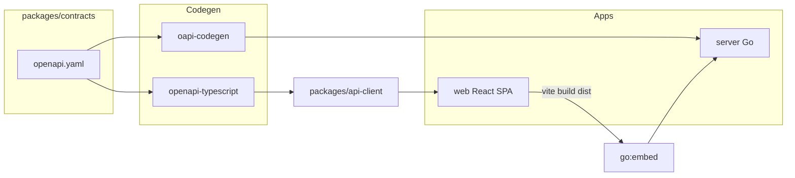

# Navidrome Replacement — Monorepo Scaffold Planı

## Mevcut durum

- Root: boş git repo, `[mise.toml](mise.toml)` (sadece pnpm)
- `[web/](web/)`: TanStack Start scaffold (React 19, Vite 8, TanStack Router/Query/Form, Biome, Vitest, shadcn, Tailwind 4, Sentry)
- **Sorun:** `web/.git` nested repo — monorepo için kaldırılmalı
- Go server yok, OpenAPI yok, turborepo yok

## Kararlar (onaylandı)


| Konu             | Seçim                                                                         |
| ---------------- | ----------------------------------------------------------------------------- |
| Frontend prod    | SPA static build → Go `embed`                                                 |
| API contract     | Spec-first (`packages/contracts/openapi.yaml`)                                |
| DB v1            | SQLite                                                                        |
| Client (gelecek) | Aynı `packages/ui` + `packages/api-client` — şimdilik scaffold only           |
| Widget layout    | Modüler slot sistemi (left/right/main); tercih server'da sync                 |
| Dokümantasyon    | **İkisi birlikte:** OpenAPI/Swagger = API ref; MDX = ürün/kullanım docs       |
| Sonraki faz      | Modüler monolith — `server/internal/modules/*` (bu planda sadece boş iskelet) |


---

## Hedef monorepo yapısı

```text
navidrome-replacement/
├── AGENTS.md                 # Agent kuralları, stack, otomasyon
├── contracts.md              # API contract kuralları (spec-first)
├── mise.toml                 # go, pnpm, node tool versions + tasks
├── turbo.json
├── pnpm-workspace.yaml
├── go.work
├── package.json              # root scripts (turbo orchestration)
├── server/                   # Go backend
│   ├── cmd/server/main.go
│   ├── internal/
│   │   ├── api/              # HTTP handlers (generated types)
│   │   ├── config/
│   │   ├── db/               # SQLite + migrations
│   │   ├── modules/          # Modüler monolith iskeleti (boş, sonraki plan)
│   │   │   ├── library/      # placeholder
│   │   │   ├── playback/
│   │   │   ├── preferences/
│   │   │   └── registry.go   # module registration pattern
│   │   └── embed/            # go:embed web dist + docs dist
│   ├── migrations/
│   ├── go.mod
│   └── Makefile / tasks via mise
├── web/                      # Mevcut React app (SPA mode)
│   ├── src/
│   ├── e2e/                  # Playwright tests
│   ├── playwright.config.ts
│   └── package.json
└── packages/
    ├── contracts/            # OpenAPI spec (source of truth)
    │   └── openapi.yaml
    ├── api-client/           # Generated TS client + types
    ├── ui/                   # Paylaşılan UI + layout/widget shell
    ├── docs/                 # MDX dokümantasyon (Fumadocs)
    ├── tsconfig/             # base, react, node configs
    └── test-utils/           # Shared vitest helpers (opsiyonel v1)
```




---

## 3 yaklaşım (değerlendirme)

### A) SPA + Go embed + spec-first (önerilen — seçildi)

- Tek production binary, NAS-friendly
- API drift yok (generate from spec)
- TanStack Start → client-only SPA'ya sadeleşir

### B) TanStack Start SSR + ayrı Node prod

- Server functions kalır
- Production'da Node + Go iki process — karmaşık, reddedildi

### C) Manuel API, monorepo yok

- Hızlı başlangıç ama client/server drift — reddedildi

---

## Faz 1: Monorepo iskeleti (execute plan'da yapılacak)

### 1.1 Root workspace kurulumu

- Root `package.json` + `pnpm-workspace.yaml` (`web`, `packages/*`)
- `turbo.json` pipeline: `build`, `dev`, `lint`, `test`, `test:e2e`, `generate`
- `go.work` → `./server`
- `mise.toml` genişlet: `go`, `node`, `pnpm`, `golangci-lint`, `oapi-codegen` tasks
- `web/.git` sil → tek root git

### 1.2 `packages/contracts` — OpenAPI spec-first

- `openapi.yaml` v0.1: `info`, `servers`, `paths` stub:
  - `GET /api/v1/health`
  - `GET /api/v1/me`
  - `GET /api/v1/preferences` / `PATCH`
- `contracts.md` kuralları:
  - Spec = single source of truth
  - Breaking change → version bump (`/api/v1` → `/api/v2`)
  - PR'da spec değişince regenerate zorunlu
  - Error response şeması standart (`ProblemDetails` veya uniform `{ error, code, message }`)

### 1.3 Codegen pipeline

- **Go:** `oapi-codegen` → `server/internal/api/gen/`
- **TS:** `openapi-typescript` + thin fetch wrapper → `packages/api-client/src/`
- Root script: `pnpm generate` → turbo task, her iki tarafı üretir
- `web` → `@repo/api-client` workspace dependency

### 1.4 Go server scaffold

- Router: `chi` veya `echo` (hafif, middleware zengin)
- Config: env + `server/config.yaml` örneği
- SQLite: `modernc.org/sqlite` veya `mattn/go-sqlite3` + `goose`/`tern` migrations
- `go:embed` → `web/dist` (build sonrası)
- Dev mod: API `:8080`, Vite dev `:3000` + proxy `/api` → Go
- Prod mod: Go static + API tek port
- Structured logging: `log/slog`
- Health endpoint OpenAPI'ye uygun

### 1.5 Web → SPA mode dönüşümü

Mevcut TanStack Start scaffold'dan:

- **Kaldır/ertele:** server functions, `instrument.server.mjs` prod path, Node `start` script
- **Koru:** TanStack Router, Query, Form, shadcn, Biome, Vitest, Tailwind, Sentry (client-only)
- Vite config: `tanstackStart({ spa: true })` veya pure SPA mode (Start plugin SPA desteği)
- `src/env.ts`: `VITE_API_URL` (dev: `http://localhost:8080`)
- Demo route'ları temizle veya placeholder bırak
- Build output: `web/dist/` → Go embed path

### 1.6 `packages/ui` — layout + widget shell (v1 scaffold)

Modüler widget yerleşimi mümkün. v1'de tam widget kütüphanesi değil, **altyapı iskeleti** kurulur:

```text
packages/ui/src/
  layout/
    AppShell.tsx          # left | main | right grid
    Slot.tsx              # named slot renderer
    LayoutProvider.tsx    # context + preferences hydrate
  widgets/
    registry.ts           # widget id → lazy component map
    types.ts              # WidgetDefinition, WidgetPlacement
  components/             # shadcn re-exports (kademeli)
```

**Layout modeli (OpenAPI `UserPreferences.layout`):**

```json
{
  "sidebarPosition": "left",
  "panels": {
    "left": ["now-playing", "queue"],
    "right": ["discover"]
  },
  "collapsed": { "left": false, "right": true }
}
```

- Kullanıcı sol/sağ panel seçer → `PATCH /api/v1/preferences`
- Server sync → tüm cihazlarda aynı layout (onaylandı)
- Gelecek native client aynı `packages/ui` + aynı preferences API kullanır
- Widget ekleme: registry'ye yeni id; sonraki modüler monolith plan'da domain widget'ları gelir

**v1 placeholder widget'lar:** `now-playing`, `queue` (boş shell, gerçek data yok)

### 1.7 Dokümantasyon — MDX + Swagger (ikisi birlikte, ya/ya değil)


| Tür           | Araç                 | Konum                                 | Kime                                     |
| ------------- | -------------------- | ------------------------------------- | ---------------------------------------- |
| API reference | OpenAPI + Swagger UI | `packages/contracts` + Go `/api/docs` | Geliştirici, agent, client codegen       |
| Ürün docs     | MDX + Fumadocs       | `packages/docs`                       | Kullanıcı, kurulum, widget customization |


**Neden ikisi:**

- Swagger = endpoint'ler, şemalar, try-it-out — API contract için doğru araç
- MDX = mimari, kurulum, customization rehberi, widget nasıl eklenir — insan okur

MDX build → static `packages/docs/dist` → Go embed `/docs` veya ayrı route.

Scaffold'da: 2-3 MDX sayfa (`index`, `getting-started`, `layout-customization`) + Swagger UI wired.

### 1.8 Go modüler monolith iskeleti (boş, sonraki plan için)

```go
// server/internal/modules/registry.go
type Module interface {
    Name() string
    RegisterRoutes(r chi.Router)
    Migrate() error  // opsiyonel
}
```

- `library/`, `playback/`, `preferences/` — boş package + README
- Sonraki plan: her domain modül kendi `internal/modules/<name>/` altında
- Bu planda sadece pattern + health/preferences modülü minimal implement

---

## Faz 2: Test altyapısı

### Unit tests


| Katman     | Araç                     | Konum                               |
| ---------- | ------------------------ | ----------------------------------- |
| Go         | `testing` + `testify`    | `server/internal/.../*_test.go`     |
| React      | Vitest + Testing Library | `web/src/**/*.test.tsx`             |
| API client | Vitest                   | `packages/api-client/src/*.test.ts` |


### E2E — Playwright

- `web/playwright.config.ts` — baseURL `http://localhost:3000` (dev) veya `8080` (prod smoke)
- `web/e2e/` — smoke: health page load, login placeholder
- Root script: `pnpm test:e2e` → turbo
- Mevcut `[.playwright/cli.config.json](.playwright/cli.config.json)` + `[.claude/skills/playwright-cli/SKILL.md](.claude/skills/playwright-cli/SKILL.md)` AGENTS.md'ye referans
- CI'da: `playwright install chromium` + headless run

### Test pyramid kuralı (AGENTS.md)

- Handler logic → Go unit test
- React component → Vitest
- Critical user flow → Playwright e2e
- OpenAPI contract → spec snapshot / breaking change review

---

## Faz 3: AGENTS.md içeriği

Agent'lar için zorunlu okuma. İçerecek bölümler:

### Stack özeti

- **Server:** Go 1.22+, chi/echo, SQLite, slog, go:embed
- **Web:** React 19, TanStack Router/Query/Form, Vite 8, Tailwind 4, shadcn, Biome, Vitest
- **Monorepo:** pnpm workspaces + turborepo
- **Contracts:** spec-first OpenAPI in `packages/contracts`

### Web paket listesi (mevcut `[web/package.json](web/package.json)`)

Dependencies ve devDependencies tablo halinde — agent hangi lib kullanacağını bilir.

### Dizin kuralları

- API değişikliği → önce `openapi.yaml`, sonra `pnpm generate`
- Go handler → `server/internal/api/`, business logic → `server/internal/service/`
- UI component → `web/src/components/` (ileride `packages/ui`)
- Migration → `server/migrations/`

### Agent otomasyon kuralları


| Ne zaman                | Ne yap                                       |
| ----------------------- | -------------------------------------------- |
| Codebase keşfi          | `graphify query` **önce** (Read/Grep öncesi) |
| Kod değişikliği sonrası | `graphify update .`                          |
| Yeni feature            | `brainstorming` skill önce                   |
| Implementasyon          | `writing-plans` → `executing-plans`          |
| Bug                     | `systematic-debugging`                       |
| Feature/bugfix kod      | `test-driven-development`                    |
| E2E doğrulama           | `playwright-cli` / `pnpm test:e2e`           |
| Kullanıcı isteği        | `caveman` modu aktif (terse yanıt)           |
| PR öncesi               | `verification-before-completion`             |


### Komutlar (mise/turbo)

```bash
mise run dev          # Go API + Vite paralel
pnpm build            # turbo: web build + go build
pnpm generate         # OpenAPI codegen
pnpm test             # unit tests all packages
pnpm test:e2e         # Playwright
```

---

## Faz 4: contracts.md içeriği

- OpenAPI spec konumu ve versiyonlama
- Endpoint naming: `/api/v1/...`
- Auth şeması placeholder (Bearer JWT — v1 stub)
- Request/response naming convention (camelCase JSON)
- Pagination, error format, id format (UUID)
- WebSocket contract placeholder (party mode gelecek — `contracts.md` notu)
- Generate komutları ve CI check: `pnpm generate && git diff --exit-code`

---

## Faz 5: Best practices (unutulanlar)

- `**.env.example**` — root + web + server
- `**.gitignore**` — `dist/`, `node_modules/`, `*.db`, `.env.local`, `server/internal/api/gen/` (generated — tartışma: gen commit edilsin mi → **evet, commit** — CI reproducibility)
- **Dockerfile** + `docker-compose.yml` — Go server + volume music + sqlite
- **GitHub Actions** — lint (biome + golangci-lint), test, generate drift check
- **pre-commit** (opsiyonel v1): biome check, go fmt
- **Renovate/Dependabot** config
- **CORS** — dev'de Vite origin allow
- **Security headers** middleware
- **Rate limiting** placeholder
- **README.md** — dev setup, architecture diagram link
- **LICENSE** — kullanıcı seçecek (plan'da placeholder)

---

## Faz 6: graphify (execute sonrası)

Execute plan tamamlandıktan sonra:

```bash
graphify . --wiki
```

→ `graphify-out/` + agent'lar için `AGENTS.md` graphify kuralı

---

## Bilinçli olarak v1 scaffold'da YOK

- Auth implementasyonu (sadece OpenAPI stub)
- Library scan / stream
- Party mode WebSocket
- Sidecar'lar
- Lua scripting
- Gerçek widget içerikleri (sadece layout shell + placeholder)
- Domain modül business logic (sadece `internal/modules/` iskelet)
- Native client app

Bunlar **sonraki modüler monolith plan**'ına kalır.

---

## Plan ayrımı


| Plan                        | Kapsam                                                                                                            |
| --------------------------- | ----------------------------------------------------------------------------------------------------------------- |
| **Bu plan (şimdi execute)** | Monorepo yapısı, Go server shell, SPA web, OpenAPI codegen, layout shell, MDX+Swagger docs, test infra, AGENTS.md |
| **Sonraki plan**            | Modüler monolith domain modülleri: library, playback, party, discover, sidecar entegrasyonu                       |


---

## Execute sırası (bu session'da build edilecek)

1. Monorepo root files
2. `packages/contracts` + codegen
3. Go server minimal + `internal/modules/` iskelet + Swagger UI
4. Web SPA + `packages/ui` layout shell + api-client
5. `packages/docs` MDX (Fumadocs) minimal
6. Vitest + Playwright smoke
7. `AGENTS.md` + `contracts.md`
8. CI + Docker skeleton
9. `graphify . --wiki`

Tahmini dokunulan dosya sayısı: ~50-70 yeni/değişen dosya.